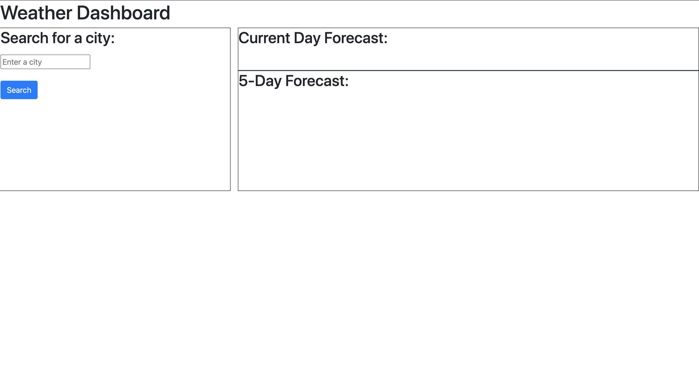

# Weather-Dashboard

## 🚀 Project Details
I developed a weather application that will take in a city name and the user is presented with the current weather forecast, and a five-day future forecast. This was developed using HTML, CSS, Javascript, Bootstrap, and the OpenWeatherMap API. 

## Screenshot of Deployed Website

## Link to Deployed Website

[Deployed Weather Dashboard Application](https://jeanette-ralph.github.io/Weather-Dashboard/)